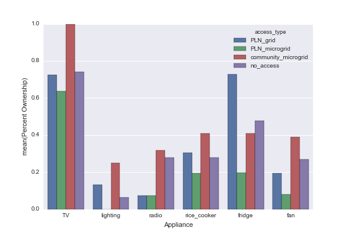
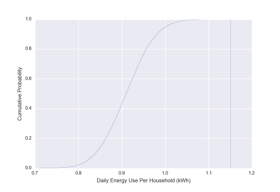

---
header-includes:
    - \usepackage[top=1.0in, bottom=1.0in, left=1.0in, right=1.0in]{geometry}
---

# Possible Titles
- Multiple estimates of latent demand using survey data
- Appliance acquisition after electricity provision
- Strategies to estimate post-electrification appliance acquisition and
    demand growth

# Abstract

- in remote areas, electricity provision must be financially viable
    without subsidy
- we explore methods to predict appliance acquisition to provide a
    bottom up model for electricity demand
- we specifically address survey-based estimates of latent demand
- these methods provide a range of estimates to be corroborated by
    future work
- we use this method in a case study of a region undergoing
    electrification

# Introduction

## Global Topic

- global electricity access is poor
- many areas require private capital to install electricity
- part of problem is upfront investment cost
- due to perceived business risk, upfront capital is costly (citation)

## Oversizing

- oversized microgrids based on overestimated demand that cannot meet
    revenue targets contribute to this perception
- Schnitzer has shown the consequences of generators with excess
    capacity on microgrid operation
    - EPP thesis work chapter three
- to avoid excess capacity, systems must be sized appropriately
- accurate sizing requires accurate demand estimation
- estimating demand in areas without access is challenging
- through more accurate appliance estimation, we may achieve more
    accurate energy estimation
- with more accurate energy estimation, a micro-utility can reduce
    the variance in revenue
- reductions in revenue variance should lead to lower-cost capital
- we explore methods for bottom up estimation of appliance ownership
    after electrification

## Contribution

- more accurate forecasting of appliance purchases, use, and resulting
    electricity demand can improve financial performance by improving
    the procurement of power generation equipment
- we use surveys of rural households to create a village level forecast
    of appliance acquisition after electrification
- this appliance forecast can be used to create a bottom-up model of
    electricity demand (cite World Bank Policy Research Working Paper 4866)
- in the short term, we do not use top-down as we do not expect the
    availability of electricity to significantly influence income

## Related Work

- other studies have made forecasts of electricity demand in areas with
    low or no access to electricity
- Wolfram et al have used an econometric approach to predict the
    appliance acquisition as communities encounter wealth
- the wolfram study forecasts appliance purchases stimulated by
    increases in wealth
- Jay Taneja IBM Nairobi paper shows district based approach to village
    pairing strategy
- We augment this pairing strategy with desire to buy
- this study forecasts energy demand by comparing similar villages
    before and after a connection to electricity

# Method

## Study Basic Detail

- The survey collected data on electricity use and assets for 1184
    households in the Lake Sentani region
- Electricity access among the surveyed households ranged from grid
    access to village-level access, to only household-level sources of energy
- The survey was designed and administered by Advancing Energy and Cenderwash University
    as part of an electrification effort in the Lake Sentani region
- The survey used the ODK platform which allows for the electronic
    collection of data from hand-held tablet devices
- The data was stored online using Ona
- We downloaded the data in an Excel format for local analysis

## Basic Survey Results

- 26 Villages
- Range of village sizes
- Range of percentage of households surveyed per village
- Average households surveyed per village
- Percentage of households surveyed per village
- Percentage of households by access type
- label: summary_table: table with number of villages by access type and number of households

## Survey Questions

- The survey was designed to ask questions relevant to the electricity
    needs of the community
- The survey collects factors on income, assets, appliance ownership,
    willingness to pay, and intention to purchase appliances
- do you currently own appliance X?
- if electricity available, will you buy appliance X?
- we demonstrate several approaches to estimating eventual ownership

## Assumptions and Caveats

- We do not have random sampling
- We do not consider economic effects since we don't observe significant
    income variations in previously connected areas
- Electricity won't significantly influence disposable income
- Households dominate microgrid energy and power demands

## Tools

- details of analysis can be found in the supplementary materials
    section
- we perform analysis using the pandas and seaborn libraries of the
    scientific python ecosystem

# Results

## Appliance ownership variation

### Method
- We observe the overall reported percentage of household reporting
    ownership of each appliance (fig or table) using survey questions
- We report for lighting, mobile phones, television, radio,
    refrigerators, fans, and rice cookers
- We then split the dataset and assign each village to an access type
    (grid, microgrid, no central access)
- We observe the reported percentage of appliance ownership in each
    access type by summing the yes/no response and dividing by the
    number of respondents
- We report the number of valid responses in each category

### Results

- We observe a low variation for TV, lighting, and mobile phone
    ownership across access types
- These are highly desirable services with modest energy requirements
- We observe higher variation for rice cookers and refrigerators with
    ownership concentrated in areas with grid connections
- Since these appliances require greater power and energy, we expect
    grid locations
- We observe variation in radio ownership with concentration of
    ownership in off-grid and community run microgrid areas
- No explanation for this observation
- bar chart
- include number of observations as part of x-axis label?
- label: appliance_ownership_by_access_type

<!-- mattrosi/2015&#45;08&#45;26&#45;App&#45;Own&#45;Grid_Type.ipynb -->

## Surveyed Appliance Desire

### Method
- we provide an estimate of post-electrification appliance ownership
    using the survey responses
- for households that don't currently own an appliance, we
- of the households that do not own an appliance, what fraction of them
    state a preference to buy one if electricity is available
- these potential purchases provide one estimate of latent demand

### Results
- Refrigerators show highest proportion of non-owners desiring ownership
- Lighting and TV show very low proportions but this could be a problem
    of survey administration
- Show bar chart with numbers

## Post-electrification estimate of appliance ownership

- we create a post-electrification estimate by adding the surveyed
    willingness or desire to purchase and add to the existing level of
    ownership
- this provides one estimate of ownership
- this is probably an overestimate
- we can use this and assumptions about the appliance energy use to
    estimate resulting increase in energy usage

## Bottom up electricity estimation

- using an estimate of post-electrification ownership, we can bound
    estimates of energy and power usage for households and villages
- from the measured proportion of appliance ownership in the reporting villages, we can construct a
    binomial probability distribution for a village about to become electrified
- from these probability distributions, we can create a monte carlo
    simulation of appliance ownership.
- each appliance could also have a probability distribution for its energy use
    per day
- these results can create a histogram of trials for the daily
    electricity use
- these can be used to bound the electricity generation supplies needed

